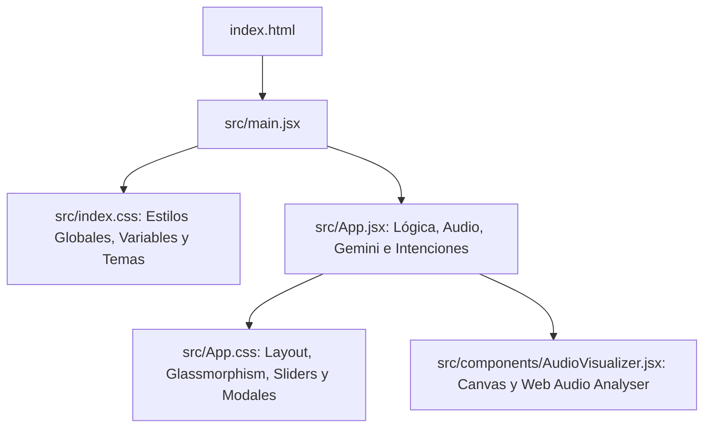

# 🎙️ Manual de Usuario & Guía de Lucy 2.0

¡Bienvenido a **Lucy 2.0**, una inteligencia artificial conversacional por voz de última generación construida con **React**, **HTML5 Canvas** y **Vite**! 

Este documento detalla el funcionamiento, la arquitectura, los comandos disponibles y los pasos para explotar todo el potencial cognitivo de Lucy conectándola con la API de Gemini.

---

## 🎨 El Núcleo de Lucy (Los 4 Estados del Orbe)

El orbe central en el panel izquierdo de Lucy representa su "corazón" digital y reacciona dinámicamente según lo que esté haciendo. Cada estado genera una animación matemática optimizada en tiempo real mediante **HTML5 Canvas**:

| Estado | Significado | Animación Visual | Rango de Frecuencia |
| :--- | :--- | :--- | :--- |
| **En Espera (Idle)** | Esperando interacción. | Un orbe bioluminiscente que "respira" suavemente con un anillo planetario orbitando de forma lenta en tonalidades frías. | 0 Hz (Silencioso) |
| **Escuchando...** | Capturando tu voz por micrófono. | Múltiples ondas concéntricas de alta sensibilidad que reaccionan y cambian de tamaño según el volumen real de tu micrófono. | Dinámica por voz |
| **Pensando...** | Procesando la respuesta (API o Local). | Un vórtice gravitacional de tres anillos entrelazados con "partículas de energía" girando rápidamente para simular computación. | Lógica cuántica |
| **Hablando...** | Expresando la respuesta por síntesis. | Ondas de Bezier superpuestas al estilo Siri/Alexa que fluyen de izquierda a derecha con amplitudes suaves sincronizadas. | Síntesis acústica |

---

## 🧠 Motores de Inteligencia (Cerebro Dual)

Lucy cuenta con dos cerebros integrados para garantizar usabilidad inmediata y máxima inteligencia cuando se requiera:

### 1. Cerebro Local Offline (Activado por defecto)
Cuando no hay una Clave API configurada, Lucy opera con un procesador de intenciones local sumamente carismático. Responde al instante (con cero latencia de red) y de forma fluida a temas preprogramados.

#### 🎙️ Comandos de Voz Offline Soportados
Puedes decir o escribir las siguientes frases para probar las capacidades de Lucy de inmediato:

* **Saludos:** *"Hola"*, *"Buenos días"*, *"Buenas noches"*, *"Qué tal"*
* **Identidad:** *"¿Quién eres?"*, *"¿Cómo te llamas?"*, *"Dime tu nombre"*
* **Creadores:** *"¿Quién te creó?"*, *"¿Quién es tu equipo?"*, *"Antigravity"*
* **Humor:** *"Cuéntame un chiste"*, *"Dime algo gracioso"*, *"Hazme reír"*
* **Estado:** *"¿Cómo estás?"*, *"¿Cómo te sientes?"*, *"¿Todo bien?"*
* **Capacidades:** *"¿Qué puedes hacer?"*, *"¿Cuáles son tus funciones?"*, *"Ayuda"*
* **Cariño:** *"Te amo"*, *"Eres muy inteligente"*, *"Me agradas"*

### 2. Cerebro Gemini IA (Omnisciente)
Al ingresar tu clave API de Gemini en la configuración, Lucy conecta sus terminales sinápticos directamente al modelo **Gemini 2.5 Flash** a través de la nube segura de Google. 

#### ✨ Beneficios del Modo Gemini
* **Memoria de Conversación:** Lucy recordará los últimos 8 turnos de la conversación para responder con contexto perfecto.
* **Sabiduría Ilimitada:** Podrás debatir de física cuántica, pedirle consejos de cocina, resúmenes literarios o pedirle traducciones al instante.
* **Formato Especial para Voz:** Lucy se auto-restringe para responder sin viñetas, códigos o símbolos de negrita (`**`), logrando una lectura de voz completamente humana y natural sin interrupciones.

---

## ⚙️ Panel de Configuración Personalizada

Haz clic en el **icono de engranaje** en la esquina superior derecha para personalizar a Lucy:

1. **Clave API de Gemini:** Inserta tu credencial. Cuenta con un botón de **Verificar** que realiza un ping de seguridad ultra-rápido a Google para validar que tu clave esté activa.
2. **Selector de Voces del Sistema:** Lucy detecta automáticamente todas las voces en español instaladas en tu dispositivo (Windows, Mac o Android) para que puedas elegir tu favorita (por ejemplo, voces de Google, Microsoft Sabina, Helena, etc.).
3. **Modo Conversación Continua:** 
   > [!TIP]
   > Activa este interruptor para tener una charla 100% manos libres. Lucy se pondrá a escuchar automáticamente en cuanto termine de responderte, permitiendo un diálogo fluido y natural sin tocar la pantalla.
4. **Deslizadores de Audio:**
   * **Velocidad de Lectura:** Ajusta qué tan rápido habla Lucy (se sugiere `1.05x` para un dinamismo moderno).
   * **Tono de Voz (Pitch):** Cambia el timbre para hacerlo más agudo o más grave.
   * **Volumen:** Ajusta la salida de audio del sintetizador de `0%` a `100%`.

---

## 🎨 Temas Visuales Premium

Lucy cuenta con tres estilos visuales que cambian dinámicamente toda la paleta de colores, sombras y comportamientos del orbe digital:

* **🌌 Midnight Blue (Predeterminado):** Un estilo elegante y tecnológico de ciencia ficción profunda con acentos de color cian brillante (`#66fcf1`), morado y azul cobalto.
* **🎀 Cyberpunk Synthwave:** Un festival de neón retro-futurista con acentos rosa magenta brillante (`#ff007f`), verde eléctrico y púrpuras profundos.
* **🟢 Quantum Emerald:** Un acabado de física cuántica con sutiles toques esmeralda (`#10b981`), dorados y cianes sobre fondo negro carbón.

---

## 🛠️ Requisitos Técnicos y Consejos

Para una experiencia óptima con Lucy, te recomendamos seguir estas sugerencias:

> [!IMPORTANT]
> **Navegador Recomendado:** Google Chrome o Microsoft Edge. Ambos navegadores soportan la API nativa de `SpeechRecognition` en español de forma excelente y con cancelación de ruido de alta fidelidad.

> [!WARNING]
> **Permisos de Micrófono:** Al hacer clic por primera vez en **"Hablar con Lucy"**, el navegador te solicitará acceso al micrófono. Debes hacer clic en **"Permitir"** para que el visualizador interactivo y el transcriptor puedan capturar tus palabras.

---

## ⚙️ Guía de Arquitectura de Archivos en el Workspace

El proyecto está estructurado con una arquitectura React limpia y escalable:

* **`index.html`:** Configura el SEO, metadatos en español, y descarga las fuentes estilizadas del servidor de Google Fonts (*Outfit*, *Inter* y *Orbitron*).
* **`src/index.css`:** Define las variables de estilos, animaciones clave (`pulseGlow`, `orbitSpin`, `floatAnim`), scanlines de pantalla de terminal retro y selectores de temas (`.theme-cyberpunk`, `.theme-quantum`).
* **`src/App.jsx`:** El centro de operaciones de Lucy. Maneja los hooks de `SpeechSynthesis` y `webkitSpeechRecognition`, guarda el historial de chat en el almacenamiento local (`localStorage`), procesa las solicitudes a Gemini mediante un Fetch directo sin backend, y resuelve las intenciones locales.
* **`src/App.css`:** Contiene los estilos detallados de los componentes de UI: el chat de burbujas, el panel lateral translúcido, los botones interactivos y el modal glassmorphic.
* **`src/components/AudioVisualizer.jsx`:** Componente de alto rendimiento gráfico que utiliza un elemento `<canvas>` y un bucle `requestAnimationFrame`. Si el usuario otorga acceso al micrófono, crea un nodo `AnalyserNode` en el flujo `AudioContext` para pintar ondas reales.
